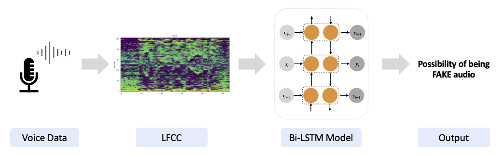

# Voice Anti-Spoofing Project

## Introduction
This project aims at developing a robust system to differentiate between real and meticulously crafted deepfake audio clips. The necessity of such a system is paramount in the era of information manipulation, where verifying the authenticity of audio content has become crucial.

## Project Overview
The core of our project is an end-to-end pipeline designed for voice anti-spoofing. It utilizes advanced machine learning techniques to identify and differentiate fake audio clips from genuine ones.

### Pipeline Overview


*Please replace the image path with the actual location of your image on GitHub or another hosting service after uploading.*

## Dataset Description
Our dataset is composed of real and fake audio samples:

- **Real Audio Dataset**: Consists of 13,100 short audio clips from the LJ Speech dataset, featuring a single speaker.
- **Fake Audio Dataset**: WaveFake, includes 104,885 generated audio clips using various architectures such as MelGAN, Parallel WaveGAN, Multi-band MelGAN, Full-band MelGAN, HiFi-GAN, and WaveGlow.

The diversity in generated audio types from WaveFake provides a broad basis for training and evaluating our anti-spoofing models.

## Installation and Usage

```bash
git clone https://github.com/Lseonghak/MIE1517-Project.git
cd MIE1517-Project
pip install -r requirements.txt